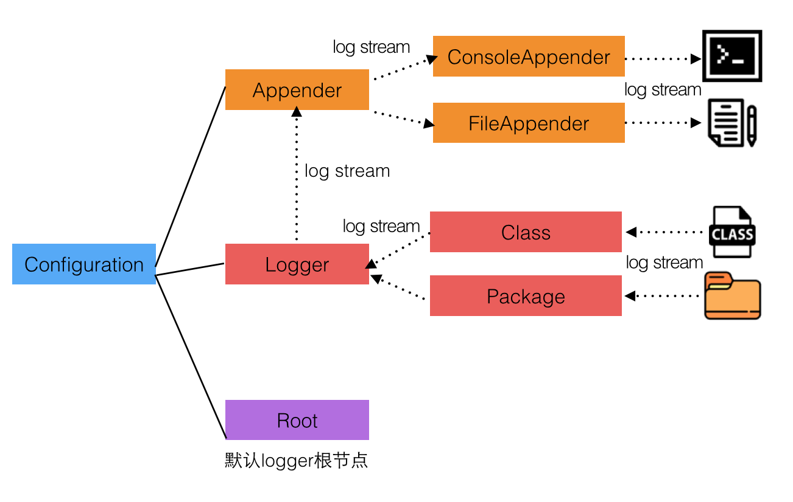
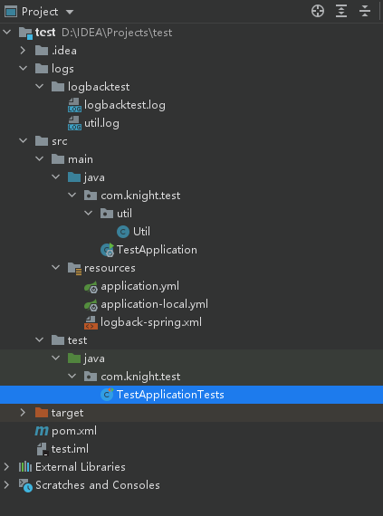
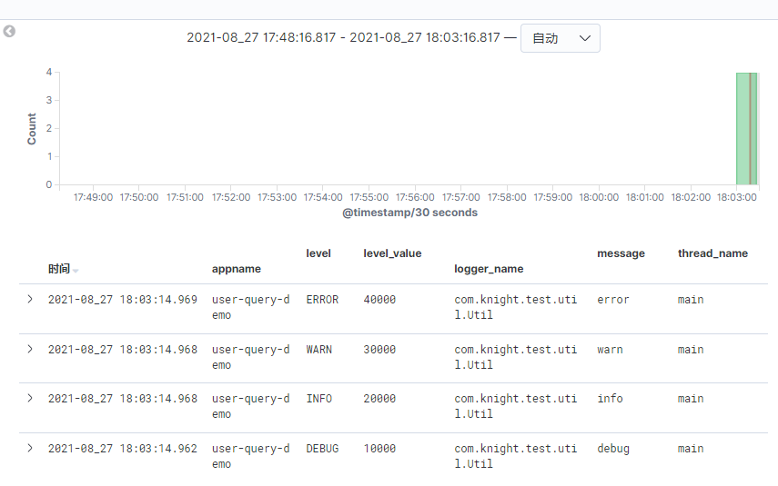
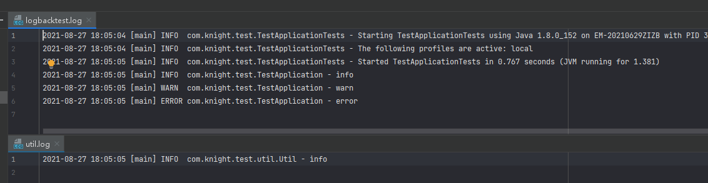
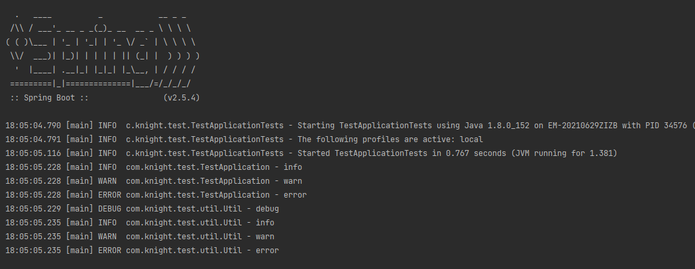

# Logback 日志

### 导入依赖

```java
    <dependencies>
        <dependency>
            <groupId>org.slf4j</groupId>
            <artifactId>slf4j-api</artifactId>
            <version>1.7.10</version>
        </dependency>
        <dependency>
            <groupId>ch.qos.logback</groupId>
            <artifactId>logback-classic</artifactId>
            <version>1.2.3</version>
        </dependency>
    </dependencies>
```

### Logback.xml 配置

- 在resources目录下添加logback.xml，默认查找该配置
- 或者在application.yml中配置如下：

```java
logging:
  config: classpath:logback-spring.xml
  file:
    path: ./logs
```

- LogBack的日志记录数据流是从 Class（Package）输入到 Logger，再经Logger分配到指定的Appender，最后从Appender输出到具体的输出终端



- appender：负责写日志的组件
  - ConsoleAppender 控制台输出
    - <encoder> : 对日志进行格式化
  - FileAppender 文件输出
    - <file>：被写入的文件名,可以是相对目录 , 也可以是绝对目录 , 如果目录不存在则会自动创建
    - <append>：如果是true , 日志被追加到文件结尾 , 如果是false,清空现存文件 , 默认是true
    - <encoder>：对日志进行格式化
  - RollingFileAppender 文件滚动输出，先将日志记录到指定文件，当符合某种条件时，将日志记录到其他文件
    - <file>：被写入的文件名，可以是相对目录，也可以解决目录，如果目录不存在则自动创建
    - <append>：如果是true，日志被追加到文件结尾，如果是false，清空现存文件，默认是true
    - <encoder>：对日志进行格式化
    - rollingPolicy：当发生滚动时，决定 RollingFileAppender 的行为，涉及文件移动和重命名
- logger：设置某一个包或者具体的某一个类的日志打印级别。指定某个类产生的日志将会执行哪个appender
  - name：用来指定受此loger约束的某一个包或者具体的某一个类
  - level：用来设置打印级别，大小写无关。可选值有TRACE、DEBUG、INFO、WARN、ERROR、ALL和OFF。还有一个特殊值INHERITED 或者 同义词NULL，代表强制执行上级的级别。如果未设置此属性，那么当前logger将会继承上级的级别
  - addtivity：是否向上级logger传递打印信息，默认为true
- root：元素配置根logger。所有日志默认走这条路径，除非被logger筛选出去
- filter：过滤节点
  - LevelFilter：级别过滤器。过滤 器会根据 onMatch 和 onMismatch 属性接受或拒绝事件
  - ThresholdFilter：临界值过滤器。过滤掉低于指定临界值的事件
  - EvaluatorFilter：评估是否符合指定的条件
  - Matchers：匹配器

```java
        <filter class="ch.qos.logback.classic.filter.LevelFilter">
            <!-- 过滤掉非INFO级别 -->
            <level>INFO</level>
            <onMatch>ACCEPT</onMatch>
            <onMismatch>DENY</onMismatch>
        </filter>


        <filter class="ch.qos.logback.classic.filter.ThresholdFilter">  
　　　　　　　　<!-- 过滤掉TRACE和DEBUG级别的日志 -->
            <level>INFO</level> 
        </filter>


        <filter class="ch.qos.logback.classic.filter.EvaluatorFilter">  
             <evaluator>
             <!--过滤掉所有日志中不包含hello字符的日志-->
                <expression>
                    message.contains("hello")
                </expression>
                <onMatch>NEUTRAL</onMatch>
                <onMismatch>DENY</onMismatch>
             </evaluator>
        </filter>


        <filter class="ch.qos.logback.classic.filter.EvaluatorFilter">  
             <evaluator> 
                <matcher>
                    <Name>odd</Name>
                    <!-- 过滤掉序号为奇数的语句-->
                    <regex>statement [13579]</regex>
                </matcher>
                <expression>odd.matches(formattedMessage)</expression>
                <onMatch>NEUTRAL</onMatch>
                <onMismatch>DENY</onMismatch>
             </evaluator>
        </filter>
```

- 配置要求：（具体实现看代码）
  
  - util目录下的文件产生的日志全部记录到：~/logs/${appname}/util.log，级别：DEBUG
  - 其余日志文件均记录到：~/logs/${appname}/${appname}.log，级别：INFO
  - 要求所有的日志均至少保存15天
  - 如果保存15天，内容太大可能造成磁盘风险，则最大保存10GB的日志

- 项目结构如下：



### 结合 Logstash

- 在 logstash.xml 中实现一个 appender，将日志传输出去，实现在 Kibana 上查看（ELK配置这里不说了，一般不是后端管的）

```java
    <!--logstash配置-->
    <appender name="LOG_STASH" class="net.logstash.logback.appender.LogstashSocketAppender">
        <filter class="ch.qos.logback.classic.filter.LevelFilter">
            <level>INFO</level>
        </filter>
        <host>${logstash_host}</host>
        <port>${logstash_port}</port>
        <customFields>{"appname":"user-query-demo"}</customFields>
    </appender>
```

- 一般有UDP和TCP两种方式，这里应该是只用了UDP方式。可能是Logstash没有配置 TCP 的实现方式

- 成功执行后，Kibana 界面展示如下，可以看到自定义的字段：



- 日志被写进本地文件中：



- 控制台输出日志：



##### 基于阻塞队列的异步打印

- 打印日志本身是需要写磁盘的，写磁盘的操作会暂时阻塞调用打印日志的业务线程，这会造成调用线程的rt（响应时间）增加
- logback 异步日志模型是一个**多生产者-消费者**模型 ，业务线程通过调用异步 appender 把日志任务放入日志队列，而日志线程使用同步的 appender 进行具体的日志打印
- 日志打印线程只需要负责生产日志并将其放入队列，而不需要关心消费线程何时把日志具体写入磁盘
- 需要注意合理设置队列大小以免造成 OOM ，队列满或者剩余元素比较少时，要根据具体场景制定reject策略以避免队列满时业务线程被阻塞

```xml
    <appender name="INFO_FILE_ASYNC" class="ch.qos.logback.classic.AsyncAppender">
        <!-- 更改默认的队列的深度,该值会影响性能.默认值为256 -->
        <queueSize>10000</queueSize>
        <!-- 添加附加的appender,最多只能添加一个 -->
        <appender-ref ref="INFO_FILE"/>
        <neverBlock>true</neverBlock>
    </appender>
```
