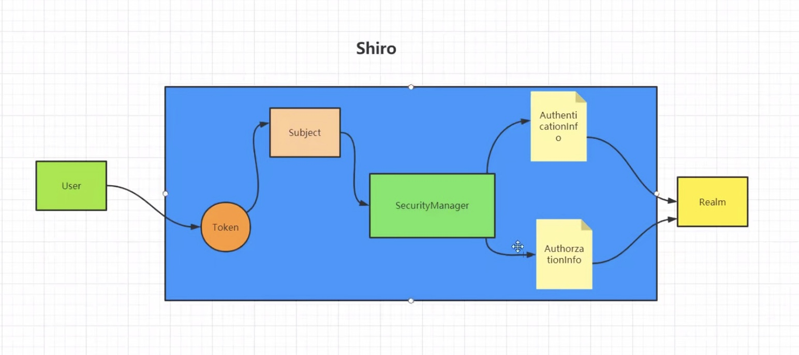

# Shiro

- [官方文档](https://shiro.apache.org/documentation.html)
- [参考视频]()

### 基本概念

- 用户、角色、权限
- 给角色赋予权限，给用户赋予角色

### 核心组件

- [UsernamePasswordToken](https://shiro.apache.org/static/1.9.1/apidocs/org/apache/shiro/authc/UsernamePasswordToken.html)
  封装用户登录信息，创建token
- SecurityManager 负责安全认证和授权
- Subject 包含了用户信息
- Realm 开发者自定义的模块，验证和授权的逻辑全部写在这里
- AuthenticationInfo 用户角色信息集合，认证时使用
- AuthorizationInfo 角色权限信息集合，授权时使用
- DefaultWebSecurityManager 安全管理器，开发者自定义的 Realm 需要注入到其中才能生效
- ShiroFilterFactoryBean 过滤器工厂，Shiro 的具体执行操作就是由 ShiroFilterFactoryBean 创建的一个个 Filter 对象来完成

        

